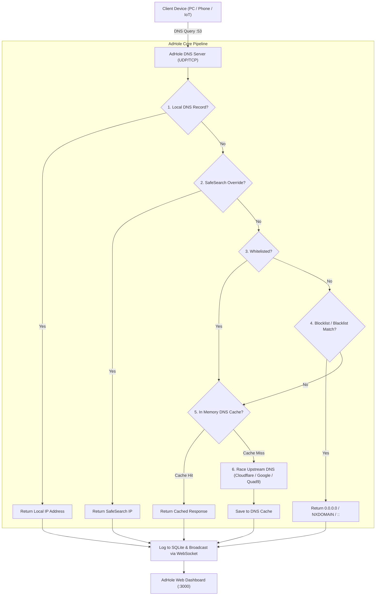

<div align="center">

# 🛡️ AdHole DNS

**A high-performance, modern, and lightweight Pi-hole alternative built with TypeScript & Bun.**

[](https://bun.com)
[](https://www.typescriptlang.org/)
[](https://opensource.org/licenses/MIT)
[](#-testing)
[](https://www.docker.com/)

[Features](#-features) • [Quick Start](#-quick-start) • [Docker Deployment](#-docker-deployment) • [Architecture](#-architecture) • [REST API](#-rest-api) • [Configuration](#-configuration) • [Router Setup](#-pointing-devices-to-adhole)

</div>

---

## 📖 Overview

**AdHole** is a network-wide ad blocker and privacy-protecting DNS server. It sinks ad networks, tracking domains, malware, and telemetry at the DNS level before they ever reach your devices, accelerating web browsing and shielding your home network.

Built natively on **Bun** with `bun:sqlite`, AdHole delivers **sub-millisecond (< 0.1ms) filtering latency**, races multiple upstream DNS providers simultaneously, and provides a modern, responsive web dashboard with live WebSocket query streaming.

---

## ✨ Features

- ⚡ **Ultra-Fast In-Memory Engine**:
  - Sub-millisecond domain matching via Trie and Hash Set algorithms.
  - Zero bloated external dependencies; uses Bun's high-speed native runtime.
- 🛑 **Comprehensive Ad & Tracker Filtering**:
  - **Standard Hosts format** (`0.0.0.0 ad.doubleclick.net`, `127.0.0.1 tracker.com`).
  - **Adblock Plus (ABP) syntax** (`||adservice.google.com^`).
  - **Plain domain lists** (`telemetry.domain.com`).
  - **Wildcard & Regex custom rules** (`*.telemetry.com`, `/^ad[0-9]+\.domain\.net$/`).
  - **Automatic Subdomain Sinking**: Blocking `doubleclick.net` automatically protects all subdomains (`stats.doubleclick.net`, etc.).
  - **Whitelist Priority**: Whitelisted domains always take precedence over blocklists.
- 🚀 **Upstream DNS Racing & Fallback**:
  - Concurrently queries multiple upstream DNS resolvers (Cloudflare `1.1.1.1`, Google `8.8.8.8`, Quad9 `9.9.9.9`, AdGuard DNS) and returns the fastest response.
- 💾 **Intelligent Decaying TTL DNS Cache**:
  - In-memory cache respecting record TTL with configurable min/max TTL limits.
- 🌐 **Modern Single-Page Dashboard & REST API**:
  - **Live DNS Query Log** with real-time WebSocket streaming.
  - **One-Click Quick Actions**: Allow or Block domains instantly from the query table.
  - **Interactive 24-Hour Activity Graph**: Permitted vs. Blocked query volume over time.
  - **Top Lists**: Top Permitted Domains, Top Blocked Domains, and Top Client IPs.
  - **Gravity Manager**: Add, toggle, and auto-update blocklist feeds with live terminal progress logs.
  - **Local DNS Records**: Custom internal domain mappings (e.g., `nas.lan -> 192.168.1.50`, `router.home -> 192.168.1.1`).
  - **DNS Diagnostic Tool**: Test domain verdicts and inspect matched rules interactively.
  - **SafeSearch Enforcement**: One-toggle strict SafeSearch for Google, Bing, DuckDuckGo, and YouTube.
- 🔒 **Privacy First**:
  - Optional IP anonymization (masks client IP octets in logs).
  - All logs and settings remain strictly local in your SQLite database.
- 🐳 **Docker & Bare Metal Ready**: Runs on Linux, macOS, Raspberry Pi (ARM/x86), and containers.

---

## 🏗️ Architecture



---

## 🚀 Quick Start

### Prerequisites
- [Bun](https://bun.sh) (v1.1+)

### Installation

```bash
# Clone the repository
git clone https://github.com/Sparky4567/adhole.git
cd adhole

# Install dependencies
bun install

# Start AdHole
bun run start
```

Open your browser at **[http://localhost:3000](http://localhost:3000)** to access the dashboard.

> [!TIP]
> **Binding Port 53 without Root**:
> On Linux, binding port `53` requires network capability. If run without privileges, AdHole will automatically fall back to port `5353`.
> To grant Bun permission to bind port `53` without `sudo`:
> ```bash
> sudo setcap 'cap_net_bind_service=+ep' $(which bun)
> ```

---

## 🐳 Docker Deployment

### Using Docker Compose (Recommended)

Create or use the provided `docker-compose.yml`:

```yaml
services:
  adhole:
    image: oven/bun:1-alpine
    container_name: adhole
    restart: unless-stopped
    build: .
    ports:
      - "53:53/udp"
      - "53:53/tcp"
      - "3000:3000/tcp"
    environment:
      - DNS_PORT=53
      - HTTP_PORT=3000
      - UPSTREAM_DNS=1.1.1.1,1.0.0.1,8.8.8.8,9.9.9.9
      - BLOCKING_MODE=ZERO_IP
    volumes:
      - ./data:/app/data
```

Run:
```bash
docker compose up -d
```

---

## ⚙️ Configuration & Environment Variables

| Variable | Default | Description |
|---|---|---|
| `DNS_PORT` | `53` | Port for the DNS server (falls back to `5353` if unprivileged) |
| `DNS_HOST` | `0.0.0.0` | IP interface to bind the DNS server |
| `HTTP_PORT` | `3000` | Port for Web Dashboard & REST API |
| `HTTP_HOST` | `0.0.0.0` | IP interface to bind Web Dashboard |
| `DATA_DIR` | `./data` | Directory for SQLite DB and cached lists |
| `UPSTREAM_DNS` | `1.1.1.1,1.0.0.1,8.8.8.8,9.9.9.9` | Comma-separated upstream DNS servers |
| `UPSTREAM_STRATEGY`| `race` | `race` (fastest response) or `fallback` (sequential) |
| `BLOCKING_MODE` | `ZERO_IP` | `ZERO_IP` (0.0.0.0), `NXDOMAIN`, `REFUSED`, or `CUSTOM_IP` |
| `CUSTOM_BLOCK_IP` | `0.0.0.0` | Custom IP returned when `BLOCKING_MODE=CUSTOM_IP` |
| `CACHE_ENABLED` | `true` | Enable/disable in-memory DNS caching |
| `CACHE_MIN_TTL` | `60` | Minimum TTL in seconds for cached records |
| `CACHE_MAX_TTL` | `86400` | Maximum TTL in seconds for cached records |
| `ANONYMIZE_IPS` | `false` | Mask client IP addresses in query logs |
| `SAFE_SEARCH_GOOGLE` | `false` | Enforce Google SafeSearch |
| `SAFE_SEARCH_BING` | `false` | Enforce Bing SafeSearch |
| `SAFE_SEARCH_YOUTUBE` | `false` | Enforce YouTube Restricted Mode |

---

## 📡 REST API Reference

| Endpoint | Method | Description |
|---|---|---|
| `/api/stats` | `GET` | Overall dashboard metrics, cache hit ratio, hourly query history, top lists |
| `/api/queries` | `GET` | Paginated query log (`?page=1&limit=50&status=blocked&search=domain`) |
| `/api/queries/clear` | `POST` | Clear query log history |
| `/api/lists` | `GET`, `POST` | List and add blocklist URLs |
| `/api/lists/:id` | `PUT`, `DELETE` | Toggle, update, or delete a blocklist |
| `/api/gravity/update`| `POST` | Trigger Gravity download & compilation of all active lists |
| `/api/rules` | `GET`, `POST` | View and add custom whitelist / blacklist rules |
| `/api/rules/:id` | `PUT`, `DELETE` | Update or delete custom rules |
| `/api/records` | `GET`, `POST` | View and add local custom DNS mappings |
| `/api/records/:id` | `DELETE` | Delete a local DNS record |
| `/api/lookup` | `GET` | Test lookup domain verdict diagnostic (`?domain=example.com`) |
| `/api/cache/flush` | `POST` | Flush in-memory DNS cache |
| `/api/settings` | `GET`, `POST` | Get and update runtime server configuration |
| `/api/system` | `GET` | System resource usage, uptime, memory, Bun version |
| `/ws/live` | `WS` | WebSocket endpoint for live query and progress streaming |

---

## 🧪 Testing

AdHole comes with a comprehensive test suite covering DNS packet decoding/encoding, filter priority rules, TTL caching, hosts parser, and API integrations:

```bash
bun test
```

```
test/filter-engine.test.ts: 6 passed
test/dns-cache.test.ts:     4 passed
test/list-manager.test.ts:   3 passed
test/dns-server.test.ts:    3 passed
test/api.test.ts:           4 passed

Total: 20 passed (100% pass rate)
```

---

## 📱 Pointing Devices to AdHole

### Option A: Network-Wide Protection (Router Setup)
1. Open your router's administration portal (e.g. `192.168.1.1` or `192.168.0.1`).
2. Go to **DHCP / Network Settings** -> **DNS Server**.
3. Set the Primary DNS Server to the local IP of your machine running **AdHole** (e.g. `192.168.1.50`).
4. Save and reboot your router. Every device on your Wi-Fi/LAN is now protected without client-side setup!

### Option B: Single Machine Setup
- **Linux**: Edit `/etc/resolv.conf` or set via NetworkManager (`nameserver 127.0.0.1`).
- **macOS**: System Settings -> Network -> Wi-Fi/Ethernet -> Details -> DNS -> Add `127.0.0.1`.
- **Windows**: Control Panel -> Network and Sharing Center -> Adapter Settings -> IPv4 Properties -> DNS: `127.0.0.1`.

---

## 📄 License

This project is licensed under the **MIT License** - see the [LICENSE](LICENSE) file for details.
